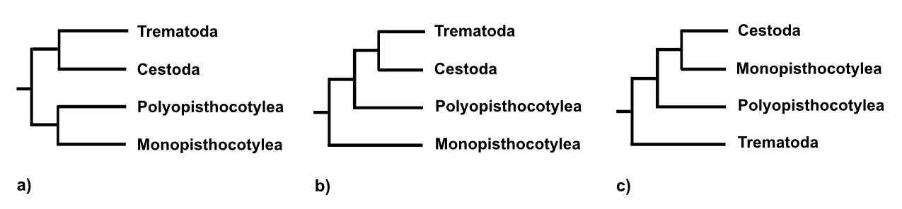

# phylogenomics-intro
Phylogenomics tutorial based on BUSCO genes

***Disclaimer***
To follow the demo and make the most of it, it helps if you have some basic skills with running software tools and manipulating files using the Unix shell command line. It assumes you have Docker installed on your computer (tested with Docker version 18.09.7, build 2d0083d; on Ubuntu 18.04).

## Introduction

We will be reconstructing the phylogenetic relationships of some parasitic flatworms based on previously published whole genome data. The list of species we will be including in the analyses, and the URL for the data download can be found in this <a href="https://github.com/chrishah/phylogenomics-intro/blob/master/data/samples.csv" title="Sample table" target="_blank">table</a>.

All software used in the demo is deposited as Docker images on <a href="https://hub.docker.com/" title="Dockerhub" target="_blank">Dockerhub</a> (see <a href="https://github.com/chrishah/phylogenomics-intro/blob/master/data/software.csv" title="software table" target="_blank">here</a>) and all data is freely and publicly available.

The workflow we will demonstrate is as follows:
- Download genomes from Genbank
- Identifying complete BUSCO genes in each of the genomes
- pre-filtering of orthology/BUSCO groups
- For each BUSCO group:
  - build alignment
  - trim alignment
  - identify model of protein evolution
  - infer phylogenetic tree (ML)
- post-filter orthology groups
- construct supermatrix from individual gene alignments
- infer phylogenomic tree with paritions corresponding to the original gene alignments using ML
- map internode certainty (IC) onto the phylogenomic tree

### Why parasitic flatworms are an interesting system for phylogenomics (in a nutshell)

The phylogenetic relationships between the three major groups of parasitic flatworms, Flukes (Trematoda), Monogenea (traditionally Monopisthocotylea and Polyopisthocotylea), and Tapeworms (Cestoda), remain controversial. The figure below shows the three main competing hypotheses, that were published over the years. Phylogenomics might give new (hopefully conclusive) insights, but particularly the Monogenea are rather underrepresented when it comes to genomic resources. We are currently working on changing that.



__1.) Download data from Genbank__

What's the first species of parasitic flatworm that pops into your head? _Schistosoma mansoni_ perhaps? Let's see if someone has already attempted to sequence its genome. 
NCBI Genbank is usually a good place to start. Surf to the [webpage](https://www.ncbi.nlm.nih.gov/genome/) and have a look. And indeed we are [lucky](https://www.ncbi.nlm.nih.gov/genome/?term=Schistosoma+mansoni).  

Let's get it downloaded. Note that the `(user@host)-$` part of the code below just mimics a command line prompt. This will look differently on each computer. The command you actually need to exectue is the part after that, so only, e.g. `mkdir assemblies`:
```bash
#First make a directory and enter it
(user@host)-$ mkdir Schistosoma_mansoni
(user@host)-$ cd Schistosoma_mansoni

#use the wget program to download the genome
(user@host)-$ wget https://ftp.ncbi.nlm.nih.gov/genomes/all/GCF/000/237/925/GCF_000237925.1_ASM23792v2/GCF_000237925.1_ASM23792v2_genomic.fna.gz

#decompress for future use
(user@host)-$ gunzip GCF_000237925.1_ASM23792v2_genomic.fna.gz
```
We have compiled a list of published genomes that we will be including in our analyses [here](https://github.com/chrishah/phylogenomics-intro/blob/master/data/samples.csv). Ideally we should download them all. You can do one by one or use your scripting skills to get them all in one go. 

Make sure that you download each into a separate directory that should be named according to the binomial (connected with underscores, rather than spaces) - see example for _S. mansoni_ above.

__2.) Run BUSCO on each assembly__

First we'll need to download an appropriate reference dataset for BUSCO - pick and choose on their <a href="https://busco-archive.ezlab.org/v3/" title="BUSCO v3" target="_blank">webpage</a>. We go for 'metazoa odb9'.

```bash
(user@host)-$ wget https://busco-archive.ezlab.org/v3/datasets/metazoa_odb9.tar.gz
```
I comes compressed, so we need to decompress:
```bash
(user@host)-$ tar xvfz metazoa_odb9.tar.gz
```

Now we want to run BUSCO to identify the set of core genes in our genome. This will take a little while for each assembly, depending on the computational resources you have available. I'll start with one to give you an example. I suggest you copy paste and hit enter for now, while it is running we will talk about some details of the command.
```bash
(user@host)-$ docker run --rm \
-v $(pwd):/in -w /in \
chrishah/busco-docker:v3.1.0 \
run_BUSCO.py \
--in ./GCF_000237925.1_ASM23792v2_genomic.fna \
--out S_mansoni \
-l ./metazoa_odb9 \
--mode genome -c 4 -f \
-sp schistosoma --augustus_parameters='--progress=true'
```

Here's some more details, as promised:
If you're new to the command line the above probably looks a bit confusing. What you have here is one long command that is wrapped across several lines to make it a bit more readable. You notice that each line ends with a `\` - this tells the shell that the command is not done and will continue in the next line. You could write everything in one line. BUSCO calls a number of other software tools that would all need to be installed on your system. In order to avoid that we use a Docker container, that has everything included. So, we tell the program `docker` to `run` a container `chrishah/busco-docker:v3.1.0` and within it we call the program `run_BUSCO.py`. We have a few other options to specify for BUSCO which I will come to soon, but that's the bare minimum - give it a try.
```bash
(user@host)-$ docker run chrishah/busco-docker:v3.1.0 run_BUSCO.py
ERROR	The parameter '--in' was not provided. Please add it in the config file or provide it through the command line
```
We get and error and it tells us that we have not provided a certain parameter. The question is which parameters are available. Command line programs usually have an option to show you which parameters are available to the user. This __help__ can in most be cases be called by adding a `-h` flag to the software call. There can be variations around that: sometimes it's `--help`, sometimes it's `-help`, but something like that exists for almost every command line program,s o this is a very important thing to take home from this exercise. Give it a try. 
```bash
(user@host)-$ docker run chrishah/busco-docker:v3.1.0 run_BUSCO.py -h
usage: python BUSCO.py -i [SEQUENCE_FILE] -l [LINEAGE] -o [OUTPUT_NAME] -m [MODE] [OTHER OPTIONS]

Welcome to BUSCO 3.1.0: the Benchmarking Universal Single-Copy Ortholog assessment tool.
For more detailed usage information, please review the README file provided with this distribution and the BUSCO user guide.

optional arguments:
  -i FASTA FILE, --in FASTA FILE
                        Input sequence file in FASTA format. Can be an assembled genome or transcriptome (DNA), or protein sequences from an annotated gene set.
  -c N, --cpu N         Specify the number (N=integer) of threads/cores to use.
  -o OUTPUT, --out OUTPUT
                        Give your analysis run a recognisable short name. Output folders and files will be labelled with this name. WARNING: do not provide a path
  -e N, --evalue N      E-value cutoff for BLAST searches. Allowed formats, 0.001 or 1e-03 (Default: 1e-03)
  -m MODE, --mode MODE  Specify which BUSCO analysis mode to run.
                        There are three valid modes:
                        - geno or genome, for genome assemblies (DNA)
                        - tran or transcriptome, for transcriptome assemblies (DNA)
                        - prot or proteins, for annotated gene sets (protein)
  -l LINEAGE, --lineage_path LINEAGE
                        Specify location of the BUSCO lineage data to be used.
                        Visit http://busco.ezlab.org for available lineages.
  -f, --force           Force rewriting of existing files. Must be used when output files with the provided name already exist.
  -r, --restart         Restart an uncompleted run. Not available for the protein mode
  -sp SPECIES, --species SPECIES
                        Name of existing Augustus species gene finding parameters. See Augustus documentation for available options.
  --augustus_parameters AUGUSTUS_PARAMETERS
                        Additional parameters for the fine-tuning of Augustus run. For the species, do not use this option.
                        Use single quotes as follow: '--param1=1 --param2=2', see Augustus documentation for available options.
  -t PATH, --tmp_path PATH
                        Where to store temporary files (Default: ./tmp/)
  --limit REGION_LIMIT  How many candidate regions (contig or transcript) to consider per BUSCO (default: 3)
  --long                Optimization mode Augustus self-training (Default: Off) adds considerably to the run time, but can improve results for some non-model organisms
  -q, --quiet           Disable the info logs, displays only errors
  -z, --tarzip          Tarzip the output folders likely to contain thousands of files
  --blast_single_core   Force tblastn to run on a single core and ignore the --cpu argument for this step only. Useful if inconsistencies when using multiple threads are noticed
  -v, --version         Show this version and exit
  -h, --help            Show this help message and exit
```

Now for the extra Docker parameters: 
 - `--rm`: each time you run a docker container it will be stored on your system, which after a while eats up quite a bit of space, so this option tells docker to remove the container after it's finished for good.
 - `-v`: This specifies so-called mount points, i.e. the locations where the docker container and your local computer are connected. I've actually specified three of them in the above command. For example `-v $(pwd):/in` tells docker to connect the present working directory on my computer (this will be returned by a command call $(pwd)) and a place in the container called `/in`. Then I also mount the place where the assemblies and the BUSCO genes that we've just downloaded are located into specific places in the container which I will point BUSCO to later on.
 - `-w`: specifies the working directory in the container where the command will be exectued - I'll make it `/in` - remember that `/in` is connected to my present working directory, so essentially the programm will run and write all output to my present working directory.
BTW, docker has a help function too:
```bash
#For the main docker program
(user@host)-$ docker --help
#For the run subprogram
(user@host)-$ docker run --help
```
Then I specify a number of parameters for BUSCO (you can double check with the information from the `-h` above), like:
 - the input fasta file, via `--in`
 - where the output should be written, via `--out`
 - where it can find the BUSCO set I have downloaded, via `-l`
 - that I am giving it a genome, via `-mode genome` (`transcriptome` is also possible her)
 - that I want to use 4 CPUs, via `-c 4`
 - that I want it to force overwrite any existing data, in case I ran it before in the same place, via `-f`
 - and finally a few parameters for one of the gene predictors BUSCO uses, it's called `augustus`

`augustus` comes pre-trained for some oranisms and it happens to contain a training set for schisosoma. If you want to know which other options you might have - the following command gives you a list of all species that augustus is trained for - ideally you would pick a species that is as closely related to your target as possible.

```bash
(user@host)-$ docker run --rm chrishah/busco-docker:v3.1.0 augustus --species=help
```

Now, let's have a look at BUSCO's output. If you followed the steps above BUSCO will have created lots of files for your genome. Let's move to there and list the files:
```bash
(user@host)-$ cd Schistosoma_mansoni/run_S_mansoni/
(user@host)-$ ls -1
blast_output
full_table_S_mansoni.tsv
hmmer_output
missing_busco_list_S_mansoni.tsv
short_summary_S_mansoni.txt
translated_proteins
``` 

Usually the most interesting for people is the content of the short summary, which gives an indication of how complete your genome/transcriptome is.
```bash
(user@host)-$ cat short_summary_S_mansoni.txt
# BUSCO version is: 3.1.0
# The lineage dataset is: metazoa_odb9 (Creation date: 2016-02-13, number of species: 65, number of BUSCOs: 978)
# To reproduce this run: python /usr/bin/run_BUSCO.py -i GCF_000237925.1_ASM23792v2_genomic.fna -o S_mansoni -l ./metazoa_odb9/ -m genome -c 4 -sp schistosoma --augustus_parameters '--progress=true'
#
# Summarized benchmarking in BUSCO notation for file GCF_000237925.1_ASM23792v2_genomic.fna
 
# BUSCO was run in mode: genome

        C:74.0%[S:72.7%,D:1.3%],F:5.4%,M:20.6%,n:978

        724     Complete BUSCOs (C)
        711     Complete and single-copy BUSCOs (S)
        13      Complete and duplicated BUSCOs (D)
        53      Fragmented BUSCOs (F)
        201     Missing BUSCOs (M)
        978     Total BUSCO groups searched
```

We're also interested in which BUSCO genes it actually found. Note that I am only showing the first 20 lines of the file below - it actually has 1000+ lines.
```bash
(user@host)-$ head -n 20 full_table_S_mansoni.tsv
# BUSCO version is: 3.1.0 
# The lineage dataset is: metazoa_odb9 (Creation date: 2016-02-13, number of species: 65, number of BUSCOs: 978)
# To reproduce this run: python /usr/bin/run_BUSCO.py -i GCF_000237925.1_ASM23792v2_genomic.fna -o S_mansoni -l metazoa_odb9/ -m genome -c 4 -sp schistosoma --augustus_parameters '--progress=true'
#
# Busco id	Status	Sequence	Score	Length
EOG091G00AH     Complete        NW_017386051.1  601331  626781  450.4   578
EOG091G00CM     Missing
EOG091G00GM     Complete        NW_017386081.1  59875   121529  1103.9  962
EOG091G00GQ     Complete        NC_031495.1     28396966        28418315        553.1   675
EOG091G00L0     Fragmented      NC_031497.1     12261511        12270432        96.0    156
EOG091G00MA     Complete        NC_031497.1     18716664        18724151        165.0   397
EOG091G00MI     Complete        NC_031498.1     11122844        11133860        186.1   204
EOG091G00Q0     Complete        NC_031495.1     34828944        34843567        1679.4  969
EOG091G00QT     Duplicated      NC_031497.1     14803536        14817948        255.3   374
EOG091G00QT     Duplicated      NC_031497.1     14821726        14851065        230.3   409
EOG091G00UD     Complete        NC_031495.1     54350454        54389664        1115.6  794
EOG091G00VZ     Complete        NC_031495.1     43353623        43366175        331.6   250
EOG091G00Z3     Complete        NC_031495.1     21812828        21829893        848.9   769
```
You get the status for all BUSCO genes, wheter they were found complete, duplicated etc., on which sequence in your assembly it was found, how good the match was, length, etc.


